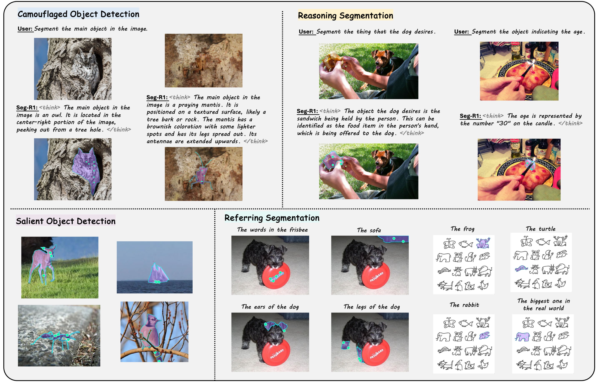

# Seg-R1: Segmentation Can Be Surprisingly Simple with Reinforcement Learning


<a href='http://arxiv.org/abs/2506.22624'></a>
<a href='https://geshang777.github.io/seg-r1.github.io/'></a>
<a href='https://huggingface.co/spaces/geshang/Seg-R1-demo'>
<a href='https://huggingface.co/datasets/geshang/FCoT'></a>
<a href='https://huggingface.co/collections/geshang/seg-r1-685fac22c65172681875d0a3'></a>


## Overview

<p align="center">
  
</p>


### Environment Setup
* We use python 3.11/CUDA 12.4/torch 2.5.1 for implementation.
* We train our models on 8 NVIDIA A100 GPUs with 80G memory, please make sure that your VRAM is sufficient to avoid the potential OOM issues during training.

```bash
# create environment
conda create -n seg-r1 python=3.11 
conda activate seg-r1
bash setup.sh

# install SAM2
mkdir third_party && cd third_party/
git clone https://github.com/facebookresearch/sam2.git && cd sam2
pip install -e .
cd checkpoints
./download_ckpts.sh
cd ../../../
```
---
### Quick Start
We provide an Gradio demo here if you want to try out the our model. You can deploy Seg-R1 easily running the following command:

```bash
python demo/seg_r1_web_demo.py
```

### Prepare Datasets

Please download and organize the required datasets ([DIS5K](https://xuebinqin.github.io/dis/index.html), [COD10K](https://drive.google.com/file/d/1vRYAie0JcNStcSwagmCq55eirGyMYGm5/view), [CAMO](https://drive.google.com/file/d/1lLDZwQ0JiUM9FxTPGUGNQJhzBEkgm7x4/view?usp=sharing), [DUTS](http://saliencydetection.net/duts/), [DUT-OMRON](http://saliencydetection.net/dut-omron/download/DUT-OMRON-image.zip), [HKU-IS](https://pan.baidu.com/s/1c0EpNfM), [ECSSD](https://www.cse.cuhk.edu.hk/leojia/projects/hsaliency/dataset.html),[RefCOCO / RefCOCO+ / RefCOCOg](https://huggingface.co/datasets/zhangtao-whu/OMG-LLaVA/blob/main/ref_seg.zip), [ReasonSeg](https://drive.google.com/drive/folders/125mewyg5Ao6tZ3ZdJ-1-E3n04LGVELqy?usp=sharing)) into the `datasets` folder following structure:

```
datasets/
├── CAMO-V.1.0-CVIU2019
│   ├── GT
│   └── Images
├── COD10K-v3
│   ├── Test
│   └── Train
├── DIS5K
│   └── DIS5K-TR
├── DUTS
│   ├── DUTS-TE
│   └── DUTS-TR
├── DUT-OMRON
├── HKU-IS
├── ECSSD
├── Refer_Segm
│   ├── coco_2014
│   │   └── train2014
│   ├── refclef
│   ├── refcoco
│   ├── refcoco+
│   └── refcocog
├── ReasonSeg
│   ├── test
│   └── val

```

And run the pre-process script:

```bash
python utils/prepare_datasets.sh
```

### Training


```bash
# SFT (optional)
bash scripts/sft.sh

# Pre-RL
bash scripts/run_prerl.sh

# RL
bash scripts/run_grpo.sh

# Fine-tune on SOD (optional)
bash scripts/run_grpo_sod.sh
```

### Evaluation

#### 1. Foreground Segmentation


##### Prepare evaluation datasets:

```bash
python utils/prepare_eval_datasets.py \
  --image_dir path/to/img \
  --gt_dir path/to/gt \
  --output_file path/to/output/file \ # e.g. eval/cod10k_test.jsonl
  --root_dir path/to/workdir
```

##### Run evaluation:

```bash
python eval/eval_foreground_segmentation.py \
    --model_path path/to/model \
    --batch_size 32 \
    --prompt_path path/to/eval/jsonl \ # e.g. eval/cod10k_test.jsonl
    --gpu_ids 0,1,2,3 \
    --vis_output_path path/to/output/folder/ \
    --dataset DATASET_NAME
```

---

#### 2. Referring Segmentation

```bash
python eval/eval_referring_segmentation.py \
  --data_root datasets \
  --image_root datasets/Refer_Segm/coco_2014/train2014 \
  --split all \
  --output_file eval/log/refseg_results.json \
  --model_path /path/to/seg-r1/weights
```

---

#### 3. Reasoning Segmentation

```bash
python eval/eval_reasoning_segmentation.py \
  --data_root datasets \
  --split test,val \
  --output_file eval/log/reasonseg_results.json \
  --model_path /path/to/seg-r1/weights

```

---


## Citation

If you find our work helpful, please cite:

```bibtex
@article{you2025segr1,
  title={Seg-R1: Segmentation Can Be Surprisingly Simple with Reinforcement Learning},
  author={You, Zuyao and Wu, Zuxuan},
  journal={arXiv preprint arXiv:2506.22624},
  year={2025}
}
```

## Acknowledgements
Seg-R1 is built upon [R1-V](https://github.com/Deep-Agent/R1-V), [open-r1](https://github.com/huggingface/open-r1) and [SAM2](https://github.com/facebookresearch/sam2). We express our gratitude to the authors for their remarkable work.


